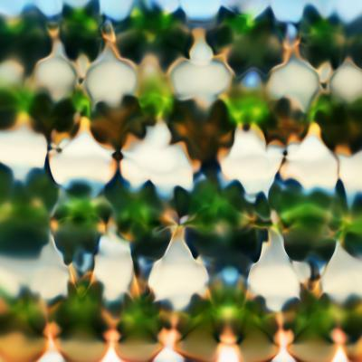
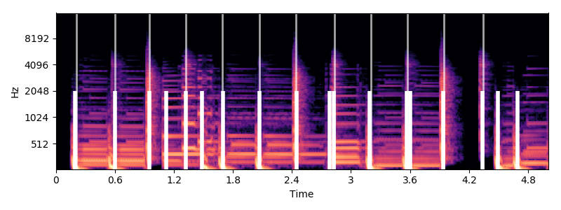

# Deep MDMA

Deep MDMA is a combination of [Lucid](https://github.com/tensorflow/lucid) and [librosa](https://librosa.github.io/librosa/).
The goal is to visualize the movement between layers of a neural network set to music.
While Lucid makes beautiful images, independently training and interpolating between them leaves the animation disjointed.
This is because the locally minimized regions of the [CPPN](https://en.wikipedia.org/wiki/Compositional_pattern-producing_network) are far from each other for each sample.
The trick was to reuse the initial coordinates from the previous model to train the next.
This provides continuity to train one image into another.

Start with python 3.6, install [tensorflow](https://www.tensorflow.org/install/), and all the requirements

    pip install -r requirements.txt

Test a single single layer render with

    python render_activations.py mixed4a_3x3_pre_relu 25

This should produce an image like the one below.
If you leave off the last two arguments, `render_activations.py` will try to build a model for every one of the 3x3 mixed layer/channels.

If all goes well, use [smooth_transfer.py](smooth_transfer.py) to generate the intermediate models, [sound/collect_beats.py](sound/collect_beats.py) to measure the beat pattern for a target wav, and finally [matching_beats.py](matching_beats.py) to put it all together. 

## All mixed4(a,b,c,d,e) channels visualized

+ [mixed4a](src/display_mixed4a.md)
+ [mixed4b](src/display_mixed4b.md)
+ [mixed4c](src/display_mixed4c.md)
+ [mixed4d](src/display_mixed4d.md)
+ [mixed4e](src/display_mixed4e.md)

## Visualization of beats using librosa

Beats are denoted by the large white line, while the fat lines indicate the onsets (kicks or hi-hats). Images change between the beats, and pulse during the onsets.
